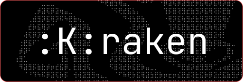

  

    <em>Kraken, a "NEW" code editor, made with new flavour, design pattern and theory </em>

---

> [!WARNING]  
> Kraken is not optimized and it *just works*, so dont fear , its in active dev

# Kraken Editor 

## Table of Contents

- [Introduction](#introduction)
- [Why we Made it](#why-kraken)
- [Degine Theory](#design-theory)
- [Features](#features)
- [Made with](#made-with)
- [How to use](#how-to-use)
- [How to build](#how-to-build)
- [Contact](#contact)
- [Contributors](#contributors)
- [License](#license)
- [Refference Video](https://github.com/NormVg/kraken/blob/master/github/refvideo.mp4)

## Introduction

Welcome to Kraken, a next-generation code editor that redefines your coding experience with innovative design and powerful features. Unlike any other editor, Kraken offers full keyboard control, a sleek interface, and seamless AI integration. Whether you're a seasoned developer or just starting out, Kraken is designed to boost your productivity and streamline your workflow. Discover the future of coding with Kraken.

## Why-Kraken?
The reason we created Kraken, despite the dominance of the feature-rich and free VS Code, is simple: we got bored of it. Many editors on the market today are starting to look like clones of VS Code, focusing heavily on adding features while neglecting the user interface. It often feels like elements are just placed wherever there's space, leading to a cluttered and less intuitive experience.

While VS Code is undeniably great, we believe there's always room for experimentation and improvement. Kraken began as a design concept in Figma, envisioning a modular code editor. After investing significant mental effort and time, the idea evolved into something more refined. We aimed to create a minimal, clean editor that truly serves functionality without sacrificing aesthetics.

Kraken is designed to be a fresh alternative, emphasizing a balanced blend of innovative UI and essential features. It's an editor that prioritizes user experience, ensuring that every element has a purpose and every feature enhances productivity. With Kraken, you get a code editor that not only works efficiently but also looks and feels right.

## Design-Theory

The design of Kraken’s UI is deeply rooted in personal experiences and inspirations drawn from a diverse set of environments and tools. During the development of Kraken, I switched entirely to Linux, transitioning through Ubuntu, Mint, and EndeavourOS, eventually settling on EndeavourOS with Hyperland and extensive customization. This journey introduced me to new design elements and concepts that significantly influenced Kraken's unique look and usability.

### Inspirations and Concepts

1. **Hyperland and Workspaces**: Hyperland’s aesthetics and usability across different workspaces greatly inspired Kraken’s design. The clean, modular, and highly customizable environment of Hyperland provided a fresh perspective on how a code editor could be structured and interacted with.

2. **Neovim and Tmux**: The customization capabilities of Neovim and Tmux served as a foundational concept for Kraken. Their focus on efficiency, minimalism, and powerful keyboard controls shaped Kraken’s core functionality and interface design.

### The Four Key Components

1. **Focus Bar**: The long bar at the bottom of the editor, designed to keep essential controls and notifications within easy reach without cluttering the main workspace.

2. **Code Editor**: The primary focus of Kraken, providing a clean and distraction-free environment for coding. The editor is designed to maximize the available space for writing code while ensuring easy access to necessary tools and features.

3. **Side Space**: Occupying 30% of the width, the side space is dedicated to displaying tools. Research indicated that 30% is the optimal space to house tools without encroaching on the coding area, maintaining a balance between accessibility and workspace efficiency.

4. **Web Apps Page**: Inspired by Dimension, this section allows users to integrate web apps like YouTube, Spotify, and GitHub directly into the editor. This feature eliminates the need to switch between a web browser and the editor, streamlining the workflow and enhancing productivity.

#### Color Palette

The color palette is based on Catppuccin, chosen for its aesthetic appeal and its suitability for a coding environment. The palette has been customized to ensure optimal readability and comfort during long coding sessions.

#### Final Design Concept

The final design of Kraken is the result of extensive research, experimentation, and a synthesis of various design inspirations. The goal was to create an editor that is not only functional but also visually appealing and enjoyable to use. By combining new UI concepts with proven design principles, Kraken offers a fresh, efficient, and immersive coding experience.

## Features

- [x] Code Editor
- [x] Intigrated Terminal
- [x] FocusBar
- [x] SideBar
- [x] FileExplorer
- [x] Tools
- [x] Intigrated Web Apps
- [ ] Settings
- [x] Command pallet
- [ ] Seamless AI intigration with ollama

## 🎮 Keyboard Shortcuts  

Kraken comes with powerful keyboard shortcuts to enhance your workflow. Below is a list of available shortcuts:  

### 🖥️ **Window & Navigation Controls**  

| **Action**                      | **Shortcut**                  |
|---------------------------------|------------------------------|
| **Toggle Sidebar**              | `Ctrl + Shift + B`           |
| **Open File Explorer Sidebar**  | `Ctrl + Shift + F`           |
| **Open Toolbar Sidebar**        | `Ctrl + Shift + T`           |
| **Switch to Previous Screen**   | `Ctrl + Shift + Alt + Tab`   |
| **Switch to Next Screen**       | `Ctrl + Alt + Tab`           |
| **Jump to Screen Window 1**     | `Shift + Alt + T`            |
| **Jump to Screen Window 2**     | `Shift + Alt + E`            |

### 🛠️ **Command Palette & Utility**  
| **Action**                      | **Shortcut**                  |
|---------------------------------|------------------------------|
| **Toggle Command Palette**      | `Ctrl + Shift + P`           |
| **Open Specific Tab (1-9)**     | `Ctrl + (1-9)`               |

### 🔥 **Easter Egg**  
| **Action**                      | **Shortcut**                  |
|---------------------------------|------------------------------|
| **Reveal Kraken's Awesomeness** | `k r a k e n i s a w s m`   |

<!-- 
🚀 **Tip**: You can modify these shortcuts based on your needs inside the settings panel! Let Kraken supercharge your workflow! ⚡ -->

## Made-with

 - Electron.Js
 - Vue.Js
 - Xterm.js
 - CodeMirror.js
 - node-pty
 - Customized Catppuccin color pallet

## 🚀 Kraken AI – Intelligent Coding & Automation  

Kraken AI is not just an assistant—it’s a fully integrated **AI-driven development companion** that enhances coding, debugging, and automation.  

### 🖥️ AI-Powered Code Assistance  
- **Smart Code Completion** → Context-aware suggestions to boost productivity.  
- **AI Refactoring** → Automatically improves code structure and efficiency.  
- **Multi-Model AI** → Supports Ollama, OpenAI, Anthropic, Google, and custom models.  

### 🌐 AI-Enhanced Web Development  
- **Live Code Injection** → Modify running web apps inside Kraken.  
- **Persistent Scripts** → Set code to auto-inject on specific websites or globally.  
- **AI Debugging** → Extract errors and logs from web views instantly.  

### 🔍 AI Watchdog – Smart Coding Assistant  
- **Action-Based AI Suggestions** → AI monitors your workflow and suggests improvements.  
- **Push-to-Apply Fixes** → One-click implementation of AI-recommended changes.  
- **Automated Code Review** → AI scans for issues and optimizes code.  

### ⚡ AI-Powered Project Management  
- **Full File System Access** → AI can create, edit, and manage project files.  
- **AI-Integrated Terminal** → Execute commands, manage dependencies, and automate workflows.  
- **API & Database Assistance** → Fetch, analyze, and structure API responses effortlessly.  

### 🛠️ Custom AI Agents & Extensions  
- **Build AI Agents** → Create task-specific AI assistants for coding and automation.  
- **Develop Custom Extensions** → Enhance Kraken with personalized plugins.  
- **Expand AI Context** → Connect external data sources to improve AI capabilities.  

### 🎯 Productivity & Workflow Enhancements  
- **Command Palette Extensions** → Add quick actions like controlling music without switching apps.  
- **AI Task Automation** → Automate repetitive tasks and streamline workflows.  
- **Seamless Context Management** → Code, test, and debug without leaving Kraken.  

Kraken AI redefines **AI-assisted coding** by offering **real-time, deep integration** with your development workflow—making it smarter, faster, and more powerful than traditional AI code editors. 🚀  

## 🌐 Why a Browser Inside a Code Editor?  

Kraken Browser is **not your normal browser**—it’s designed **exclusively for coding** and **deeply integrated with AI** to enhance development, debugging, and automation. While it’s not meant for daily browsing, it **unlocks powerful new capabilities** within your coding environment.  

### 🛠️ Direct Web App Integration  
- **Test & Debug Instantly** → No need to switch between a browser and your editor.  
- **Live AI Debugging** → AI extracts code, logs, and errors from running web apps.  
- **Seamless Code Injection** → Modify any web app inside Kraken in real time.  

### 🚀 Build & Preview Web Apps in One Place  
- **No More Context Switching** → Code, test, and modify web apps without leaving Kraken.  
- **Persistent Scripts & Customization** → Automate UI tweaks, inject scripts, and enhance web experiences.  
- **Web & Code in Sync** → Changes reflect instantly, making frontend and backend development seamless.  

### 🔗 AI-Powered Web Automation  
- **AI Debugging for Websites** → Kraken AI can analyze any loaded web page.  
- **Automate & Extend Web Apps** → Use AI or scripts to modify websites dynamically.  
- **Web App Extensions** → Create custom Kraken extensions that interact directly with web content.  

Kraken Browser is built **for developers, not for general web use**—leveraging AI to make **coding, debugging, and automation faster and more intuitive than ever before**. 🚀  

## How-to-use

Detailed instructions on how to install and set up the project.
*if your are on linux you can directly use ./run.sh*

    cd Kraken

    npm install

    npm run rebuild:electron

    npm run dev

## How-To-Build
*if your are on linux you can directly use ./build.sh*

    cd Kraken

    npm install

    npm run rebuild:electron

    npm run dev
    
    cd ./dist/linux-unpacked/

    ./kraken

## Contact
- Vishnu Gupta 
- Email : [thenormvg@gmail.com](mailto:thenormvg@gmail.com)
- Twitter : [TheNormVg](https://x.com/TheNormVg)

## Contributors
- [Vishnu Gupta](https://github.com/NormVg)

## License
Distributed under the MIT License. See LICENSE for more information.
